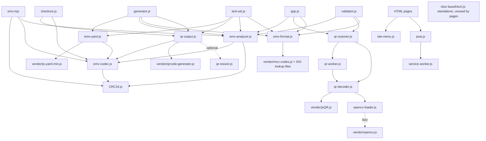

# EMV Merchant-Presented QR-Code Parser and Generator

Static browser/Progressive Web Application (PWA) tools for **EMV Merchant-Presented QR-Codes**.

Current application version: **0.10.0**.

Live test version: <https://tontg.github.io/mpqr>

This project supports:

- parsing EMV Merchant-Presented QR payloads from image files
- parsing EMV Merchant-Presented QR payloads from a live camera stream
- validating EMV Merchant-Presented QR payload structure and CRC
- exporting parsed EMV Merchant-Presented QR content as YAML and Markdown
- generating EMV Merchant-Presented QR payloads and QR images from YAML
- generating fixed checkout QR codes from configured merchant fields
- presenting a configurable QR scanner test set with labeled codes and manual coverage tracking
- batch validation of multiple QR images with ZIP, TXT, CSV, YAML, and Markdown reports
- offline-friendly usage as a static PWA

Scope clarification:

- supported: **EMV Merchant-Presented QR Codes**
- not supported as a primary target: EMV Consumer-Presented QR, non-EMV QR payment formats, or proprietary QR formats that are only loosely inspired by EMV

[Official EMV QR-Code overview](https://www.emvco.com/emv-technologies/qr-codes/)

[Quick introduction to EMV QR-Codes (21 slides)](https://www.w3.org/2020/Talks/emvco-qr-20201021.pdf)

Examples of payment schemes and implementations related to EMV Merchant-Presented QR:

| Scheme           | Country/Region |
| ---------------- | -------------- |
| SGQR             | Singapore      |
| PromptPay        | Thailand       |
| QR Ph            | Philippines    |
| DuitNow QR       | Malaysia       |
| VietQR           | Vietnam        |
| KHQR             | Cambodia       |
| Bharat QR        | India          |
| QRIS             | Indonesia      |
| UnionPay QR Code | China          |
| [MarocPay](https://www.bkam.ma/content/download/612251/6778239/version/1/file/LC-BKAM-2018-70.pdf)         | Morocco        |

## License

Project source code is licensed under the Apache License, Version 2.0.

Copyright 2026 Gilles Reant.

Vendored third-party dependencies retain their own licenses.

EMV® is a registered trademark exclusively owned by EMVCo, LLC. QR Code is registered trademark of DENSO WAVE INCORPORATED.

## Features

- Parse QR codes from an image file.
- Parse QR codes from a live camera stream.
- Optional OpenCV preprocessing for camera and image decoding.
- Paste and parse raw EMV QR payload text.
- Display:
  - raw hexadecimal data
  - character count
  - byte count
  - parsed TLV arborescence
  - validation result and findings
  - YAML representation of the QR content as parsed
- Export parsed QR content as YAML.
- Generate an EMV QR code from YAML.
- Automatically compute and append `63 04` CRC-16/CCITT-FALSE when missing.
- Download generated QR code as SVG or PNG.
- Resize generated QR codes directly in the browser.
- Navigate between pages with a shared top-right hamburger menu.
- Expose `window.MerchantPresentedQrCode.render(...)` as a browser helper for embedding EMV Merchant-Presented QR codes in your own HTML.

## Pages

- Home: `public/index.html`
- Parser: `public/parser.html`
- About: `public/about.html`
- Generator: `public/generator.html`
- Checkout: `public/checkout.html`
- Render API sample: `public/render.html`
- Scanner test set: `public/test-set.html`
- Validator: `public/validator.html`

The `About` content is centralized in `public/about.html` and is reachable from every page through the shared hamburger menu.

The app is designed to work as static files. There is no Node server, backend API, or XHR dependency for parsing or generation.

Privacy note: processing stays inside the browser; there is no upload endpoint or third-party runtime service. Internal links use URL fragments. Legacy query-parameter imports can appear in hosting logs on the initial request; see Data Privacy below.

All browser dependencies used by the application are vendored under `public/`.

## Run Locally

Serve the files below through a simple static HTTP server, such as Apache HTTPD.
Use HTTPS in production or HTTP on localhost for development. Direct `file:`
opening is not supported: browsers cannot enforce script integrity there.
No Node server, backend API, installation or build step is needed.

```text
public/index.html
public/parser.html
public/generator.html
```

For camera access and PWA service-worker support, browsers require a secure context. Use HTTPS in production. `localhost` is also treated as secure by modern browsers during development.

`public/parser.html` automatically redirects from HTTP to HTTPS on non-localhost hosts.

Serve `public/` with any simple static HTTP server, such as Apache HTTPD. This repository is intended to be usable as a fully static artifact.

## PWA

The app includes:

- `public/manifest.webmanifest`
- `public/service-worker.js`
- `public/pwa.js`
- `public/icons/app-icon.svg`

When served over HTTPS or `localhost`, the service worker caches known static assets in a deployment-path-specific namespace. New `?qr=` URLs use the cached page shell offline; payload parameters are never cache keys. OpenCV is downloaded/cached only after the first failed normal decode with preprocessing enabled. Before that download, offline scans use the JavaScript fallbacks.

## Deployment

Publish the **contents of `public/`** as the website document root. Keep its
vendored license notices, and include the root LICENSE and NOTICE with source
or release distributions. Do not publish `.git`, tests, tools or specifications.
No build step, package installation or Node server is required.

The included `public/.htaccess` configures Apache security headers and MIME
types when overrides are enabled. Other static hosts should use equivalent
settings from [SECURITY.md](SECURITY.md). Inline configuration and script SRI
hashes are checked by `node tools/audit.mjs`; maintainers refresh hashes with
`--write` after editing scripts or inline HTML configuration. Version 0.10.0
adds the `emv-codec.js` dependency to embedding examples.

## Data Privacy

QR decoding, EMV parsing, validation, generation and all reports run locally.
No images, camera frames or reports are uploaded, and no third-party API or
CDN is contacted at runtime. Browser requests only retrieve static app assets.

Internal parser/generator handoffs use `#qr=...`; checkout uses `#a=...&l=...`.
Fragments are not sent to the HTTP server but remain visible in copied URLs,
browser history and extensions. Existing `?qr=`, `?a=` and `?l=` links are
still accepted. **Their initial request may reach hosting logs**, before a
service worker controls the page. HTTPS cannot conceal query strings from
the hosting server. Do not share sensitive payloads in either form of URL.

Reports are local downloads. CSV cells are protected for spreadsheet viewing;
use YAML/raw hex when exact original values are needed by another program.
See [SECURITY.md](SECURITY.md) for limits, CSP and deployment details.

## OpenCV Preprocessing

On the parser and validator pages, the **OpenCV preprocessing** checkbox affects QR-Code detection from image files and live camera frames only. It does not modify the decoded EMV payload.

When enabled, the browser first tries QR decoding on the original canvas image. It then also tries a preprocessed version using OpenCV.js:

1. Copy the failed original image into an OpenCV Mat with `cv.matFromImageData(...)`.
2. Convert RGBA image data to grayscale with `cv.cvtColor(..., cv.COLOR_RGBA2GRAY, ...)`.
3. Apply a small Gaussian blur with a `3 x 3` kernel.
4. Apply adaptive Gaussian thresholding with:
   - maximum value: `255`
   - method: `cv.ADAPTIVE_THRESH_GAUSSIAN_C`
   - threshold type: `cv.THRESH_BINARY`
   - block size: `31`
   - constant: `5`
5. Run QR detection again on that thresholded image with `jsQR`.

For static image uploads, if the initial decode attempts fail, the parser redraws the image to an oversampled canvas up to `2x`, capped at `2800 px` on the longest side, and repeats the same decode path. This helps when QR modules are too small in the uploaded raster. Camera frames do not use this oversampling step for performance reasons.

This is intended to help with uneven lighting, low contrast, glare, and camera noise. OpenCV is loaded lazily in a worker after the first original-image attempt fails. If it is unavailable, a warning is returned and JavaScript fallbacks continue.

A further try-harder pass uses up to 3x sampling (3600 px before rotation),
rotations of 0, -12, -8, -4, 4, 8 and 12 degrees, grayscale and three contrast/
threshold variants. Variants are created one at a time, and processing stops
on the first successful decode. Parser and validator share the exact pipeline.
After jsQR variants fail, OpenCV's QRCodeDetector is also tried when available.
Workers keep the UI responsive and can be terminated on cancellation.
Camera scans stop their media tracks after decoding. Camera timings measure
the successful frame's work, not time spent aiming the camera.

Limits: 20 MiB/image, 32 megapixels, 100 files/100 MiB per batch, 128 MiB/report.
Workers time out after 45 seconds. A warning is added above 1.5 seconds.
Old browsers without workers use a yielding main-thread fallback without
OpenCV. Browser tests cover Chromium at desktop/mobile sizes; actual iOS
camera and installed-PWA behavior still require device testing.

## YAML Format

The generator and parser export use a shorthand TLV format:

```yaml
fields:
  - "00": "01"
  - "01": "11"
  - "26":
      - "00": "COM.EXAMPLE.PAY"
      - "01": "MERCHANT123"
  - "52": "5812"
  - "53": "840"
  - "58": "US"
  - "59": "EXAMPLE MERCHANT"
  - "60": "NEW YORK"
```

Nested arrays represent EMV template fields.

If field `63` (CRC) is omitted, the generator appends:

```text
6304 + CRC-16/CCITT-FALSE
```

If field `63` is present, it must be the final field and must contain a four-character CRC value:

```yaml
  - "63": "9EE7"
```

The default Generator page sample is configured in `public/generator.html` with the `EMVQR_GENERATOR_STATIC_FIELDS` JavaScript constant. Edit that object when the default static merchant fields need to change without touching `generator.js`.

The Checkout page fixed merchant fields are configured in `public/checkout.html` with the `EMVQR_CHECKOUT_STATIC_FIELDS` JavaScript constant. Use `{{amount}}` for the dynamic field `54` value and `{{reference}}` for the dynamic field `62-05` value; empty dynamic values are omitted from the generated QR payload.

Generated QR images on the Generator, Checkout and Scanner test set pages can be resized in the browser by dragging the lower-right corner. The QR display remains square, and the chosen size is retained when the code changes.

## Scanner Test Set

Open `public/test-set.html` to present six fictional EMV Merchant-Presented QR
codes to an external scanner. Previous/Next and a case selector retain the YAML
order. Each case has a title, description, resizable QR, expected payload,
character/byte counts, QR version/error correction, CRC, read-only YAML (including
CRC) and hexadecimal content. All examples pass the project's implemented EMV
checks; these are not real payment credentials or certified scheme test vectors.

The supplied cases cover a merchant without an amount, USD with an invoice
reference, a small EUR amount, a denser payload, and Chinese/Arabic alternate
merchant names. Together they cover L, M, Q and H error correction.

Edit **`public/samples/qr-test-set.yaml`** to add, remove, reorder or change cases.
No JavaScript changes or build are required. Each case uses this shape:

```yaml
title: Scanner test set
description: Fictional merchants. Do not use for payments.
codes:
  - id: example-merchant
    title: Merchant without an amount
    description: Basic ASCII test case.
    errorCorrection: L
    fields:
      - "26":
          - "00": "COM.EXAMPLE.PAY"
          - "01": "MERCHANT001"
      - "52": "5812"
      - "53": "840"
      - "58": "US"
      - "59": "EXAMPLE MERCHANT"
      - "60": "NEW YORK"
```

Each case requires a unique `id`, a `title`, and a `fields` array. IDs use lowercase
letters, digits, underscores or hyphens, starting with a letter or digit (64
characters maximum). Titles are limited to 120 characters and optional descriptions
to 500. `errorCorrection` is optional, defaults to `L`, and accepts `L`, `M`, `Q`,
or `H`. The set supports 1-50 entries within a 64 KiB YAML file. Existing bounded
YAML/field checks apply; unknown configuration properties are rejected.

Missing root fields `00=01` and `01=11` are inserted, and field `63` is always
recalculated. The payload does not depend on the date, time or navigation state.
Do not include a CRC to intentionally test a bad checksum: this page regenerates
it. Semantic errors in custom cases are displayed without claiming EMV validity.

Use **Tested with my scanner** after comparing the scanner result with the
expected content. The counter and selector track manually checked cases, not
automatic detection by the external scanner. Progress stays in memory only;
Reset progress, Reload test set or a page reload starts a new run.

**Reload test set** fetches the YAML from the same static host with HTTP cache
revalidation. Its service-worker strategy is network-first, so YAML-only edits
do not need a cache-version bump. Offline, the last fetched copy is used. There
is no upload, backend API, browser editor or third-party request.

## Browser API

The project exposes a small browser-side helper for embedding an EMV Merchant-Presented QR-Code into an HTML element:

```js
window.MerchantPresentedQrCode.render(targetElement, fields, options)
```

Dependencies:

- `public/vendor/qrcode-generator.js`
- `public/CRC16.js`
- `public/emv-codec.js`
- `public/qr-output.js`

Optional dependency:

- `public/qr-resizer.js` if you want the rendered QR container to participate in the existing resize helper

Behavior:

- auto-adds top-level field `"00": "01"` if missing
- auto-adds top-level field `"01": "11"` if missing
- removes any top-level field `63` from the input
- appends a fresh `63 04` CRC-16/CCITT-FALSE
- injects the QR-Code SVG into the target element

Optional behavior:

- `options.preserveExistingCrc: true` keeps a provided top-level field `63` when it is final, formatted correctly, and its checksum matches the payload

Example:

```html
<div id="merchantQr"></div>
<script src="vendor/qrcode-generator.js"></script>
<script src="CRC16.js"></script>
<script src="emv-codec.js"></script>
<script src="qr-output.js"></script>
<script>
  const { Fields: F, AdditionalDataFields: A, TemplateFields: T } = window.MerchantPresentedQrCode;
  // Field IDs chosen by the COM.EXAMPLE.PAY scheme.
  const ExamplePay = Object.freeze({
    MERCHANT_ACCOUNT_INFORMATION: "26",
    MERCHANT_ID: "01"
  });
  const fields = [
    {
      [ExamplePay.MERCHANT_ACCOUNT_INFORMATION]: [
        { [T.GLOBALLY_UNIQUE_IDENTIFIER]: "COM.EXAMPLE.PAY" },
        { [ExamplePay.MERCHANT_ID]: "MERCHANT123" }
      ]
    },
    { [F.MERCHANT_CATEGORY_CODE]: "5812" },
    { [F.TRANSACTION_CURRENCY]: "840" },
    { [F.TRANSACTION_AMOUNT]: "12.34" },
    { [F.COUNTRY_CODE]: "US" },
    { [F.MERCHANT_NAME]: "EXAMPLE MERCHANT" },
    { [F.MERCHANT_CITY]: "NEW YORK" },
    {
      [F.ADDITIONAL_DATA_FIELD_TEMPLATE]: [
        { [A.REFERENCE_LABEL]: "INV-1001" }
      ]
    }
  ];

  const result = window.MerchantPresentedQrCode.render(
    document.getElementById('merchantQr'),
    fields,
    {
      errorCorrection: 'L',
      cellSize: 8,
      quietZoneModules: 2,
      altText: 'Merchant payment QR code',
    }
  );

  console.log(result.payload);
  console.log(result.crc);
  console.log(result.hex);
</script>
```

### Named Field Constants

The render API exposes four frozen constant groups. No extra dependency is needed:

- `Fields`: root fields, such as `MERCHANT_NAME` (`"59"`) and `TRANSACTION_AMOUNT` (`"54"`).
- `AdditionalDataFields`: children of field `62`, such as `REFERENCE_LABEL` (`"05"`).
- `LanguageFields`: children of field `64`, such as `LANGUAGE_PREFERENCE` (`"00"`).
- `TemplateFields`: `GLOBALLY_UNIQUE_IDENTIFIER` (`"00"`) within merchant account,
  unreserved and payment-system-specific templates.

Use computed property keys: `{ [F.MERCHANT_NAME]: "EXAMPLE MERCHANT" }` produces
exactly `{ "59": "EXAMPLE MERCHANT" }`. Numeric keys remain supported, can be mixed
with constants, and remain the format for JSON/YAML exports. Literal keys such as
`"Merchant Name"` are not aliases and are rejected. Name scheme-specific fields
with your own constants, as in `ExamplePay` above: `MERCHANT_ACCOUNT_INFORMATION`
selects root slot `"26"`, and `MERCHANT_ID` selects its child `"01"`. `ExamplePay`
is defined by the sample, not exported by the library. These choices belong to
the example scheme; `26-01` is not universally a merchant ID. Adapt the constants
to your payment scheme without modifying the library's frozen maps.
Array order, automatic defaults and CRC calculation are unchanged.

The same constants are named exports from `public/emv.mjs`, with TypeScript
declarations in `public/emv.d.mts`. See the [full constant reference](docs/API.md#field-constants)
and [Render API sample](public/render.html).

### Parameters

- `targetElement`: a DOM element or CSS selector string
- `fields`: EMV Merchant-Presented field array in the same shorthand format used by the generator and YAML export
- `options.errorCorrection`: `L`, `M`, `Q`, or `H` (default: `L`)
- `options.cellSize`: SVG module size in pixels (default: `8`)
- `options.quietZoneModules`: white border width in modules (default: `2`)
- `options.altText`: SVG title/description text
- `options.preserveExistingCrc`: preserve a valid final field `63` instead of regenerating it (default: `false`)

Return value:

- `payload`: final EMV payload string including CRC
- `crc`: computed field `63` value
- `hex`: payload hexadecimal string
- `characters`: payload character count
- `bytes`: payload UTF-8 byte count
- `svg`: injected SVG markup
- `fields`: normalized field array after automatic field insertion
- `version`: QR-Code version selected by `qrcode-generator`

## Sample YAML

A valid sample without field `63` is available at:

- `public/samples/valid-emvqr-without-crc.yaml`

## Libraries

The browser pages use local vendored copies of these libraries:

| Library | Version | License | Purpose |
| --- | --- | --- | --- |
| Local EMV TLV parser | 0.10.0 | Apache-2.0, Copyright Gilles Reant | TLV parsing, validation, and CRC-16/CCITT-FALSE |
| `jsQR` | 1.4.0 | Apache-2.0 | QR decoding from image/canvas data |
| `OpenCV.js` | 4.14.0-pre, revision 723670c33d | Apache-2.0 | Optional image preprocessing |
| `js-yaml` | 4.3.2 | MIT | YAML parsing |
| `qrcode-generator` | 2.0.4 | MIT | QR image generation |
| `mcc-codes` | Vendored static lookup from greggles/mcc-codes | Unlicense / public domain dedication | Merchant Category Code descriptions |
| `currency-codes` | Vendored static ISO 4217 numeric-code lookup from datasets/currency-codes | Public Domain / PDDL | Transaction Currency (field 53) descriptions |
| `country-codes` | Vendored static ISO 3166-1 alpha-2 lookup from datasets/country-codes | Public Domain / PDDL | Country Code (field 58) descriptions |
| `language-codes` | Vendored static ISO 639 alpha-2 lookup from datasets/language-codes | Public Domain / PDDL | Language Preference (field 64-00) descriptions |

OpenCV.js is vendored locally at `public/vendor/opencv.js` to avoid cross-origin loading and allow Subresource Integrity.

The MCC lookup is vendored locally at `public/vendor/mcc-codes.js` from `greggles/mcc-codes`:

- Website: <https://github.com/greggles/mcc-codes>
- Local license text: `public/vendor/mcc-codes.LICENSE.txt`

The ISO 4217 currency lookup is vendored locally at `public/vendor/iso4217-codes.js` from `datasets/currency-codes`:

- Website: <https://github.com/datasets/currency-codes>
- Local license text: `public/vendor/iso4217-codes.LICENSE.txt`

The ISO 3166-1 alpha-2 country lookup is vendored locally at `public/vendor/iso3166-alpha2-codes.js` from `datasets/country-codes`:

- Website: <https://github.com/datasets/country-codes>
- Local license text: `public/vendor/iso3166-alpha2-codes.LICENSE.txt`

The ISO 639 alpha-2 language lookup is vendored locally at `public/vendor/iso639-language-codes.js` from `datasets/language-codes`:

- Website: <https://github.com/datasets/language-codes>
- Local license text: `public/vendor/iso639-language-codes.LICENSE.txt`

## JavaScript Files

Application code (all under `public/`):

| File | Responsibility |
| --- | --- |
| `CRC16.js` | UTF-8 CRC-16/CCITT-FALSE |
| `emv-codec.js` | Bounded field normalization, TLV serialization, defaults and CRC insertion |
| `emv-analyzer.js` | Context-aware parsing, validation and structured diagnostics |
| `emv.mjs` | Native ES-module core exports; types in `emv.d.mts` |
| `emv-format.js` | Shared YAML export, metadata, labels, CSV and Markdown escaping |
| `emv-yaml.js` | Restricted, bounded field and scanner test-set YAML import |
| `qr-output.js` | Synchronous browser render API and SVG/PNG/WebP downloads |
| `qr-resizer.js` | Square pointer-driven QR resizing |
| `qr-decoder.js` | Shared incremental original/OpenCV/try-harder image pipeline |
| `qr-scanner.js` | File loading, worker lifecycle, cancellation and resource limits |
| `qr-worker.js` | Background decoder entry point |
| `opencv-loader.js` | Lazy integrity-checked OpenCV loading |
| `app.js` | Parser page, image preview and camera lifecycle |
| `generator.js` | YAML generator page and CRC refresh |
| `checkout.js` | Checkout inputs, private permalink and shared rendering |
| `validator.js` | Batch results, filters, progress, bounded report ZIP and printing |
| `test-set.js` | Configurable scanner test cases, expected content, navigation and manual coverage |
| `site-menu.js` | Shared page navigation |
| `pwa.js` | Optional service-worker registration |
| `service-worker.js` | Scoped static/offline caches |
| `cbor-base64url.js` | Bounded legacy CBOR subset helper; no page loads it |

Vendored code (under `public/vendor/`):

| File | Responsibility |
| --- | --- |
| `jsQR.js` | QR image decoding; local error-correction metadata patch |
| `qrcode-generator.js` | QR matrix and SVG generation |
| `js-yaml.min.js` | YAML syntax parser |
| `opencv.js` | Optional WASM image preprocessing |
| `mcc-codes.js` | MCC descriptions |
| `iso4217-codes.js` | Currency descriptions |
| `iso3166-alpha2-codes.js` | Country descriptions |
| `iso639-language-codes.js` | Language descriptions |

Exact versions, upstream revisions, hashes and notices are recorded in
[the vendor manifest](public/vendor/manifest.json).
[PATCHES.md](public/vendor/PATCHES.md) documents local modifications and
`tools/generate-lookups.ps1` reproducibly regenerates the four datasets.
The legacy OpenCV artifact is checksum-pinned; its original complete build
recipe is unavailable and a byte-reproducible rebuild is not claimed.

## JavaScript Dependency Graph



## Validation Scope

Only **EMV Merchant-Presented** QR payloads are supported. `valid` means no
errors under implemented checks, not full EMVCo certification, scheme
certification, merchant authentication or payment authorization.
See [the rule coverage table](docs/VALIDATION.md) for supported and deliberately
unimplemented checks, including scheme-specific rules and later bulletins.

For third-party integration, see [API contracts and extension rules](docs/API.md).
The pure core needs no DOM or QR/YAML libraries. Native browser modules work
without a bundler; the existing `window.MerchantPresentedQrCode.render(...)`
API remains available with the documented script dependencies.

## Validator ZIP Report

Each completed batch automatically downloads a timestamped report ZIP,
subject to the 128 MiB limit. It includes original images in `pictures/`,
ordered YAML with errors/warnings in `yaml/`, readable trees in `markdown/`,
and `report.txt`/`report.csv`. TXT dates use the browser's time zone; both the
UI and reports include decode/parse timing. The display filter does not remove
files from reports. Starting a new batch cancels old scans and pending reports.

## Maintenance

See [CONTRIBUTING.md](CONTRIBUTING.md), [SECURITY.md](SECURITY.md) and
[CHANGELOG.md](CHANGELOG.md). Optional development checks require Node 22+, not
a production Node server or package installation:

```sh
node --test tests/*.test.mjs
node tools/audit.mjs
```

Browser regressions are described in CONTRIBUTING and run in CI. Release
checks cover Unicode round trips, malformed TLVs/YAML, CSV safety, cache
isolation, offline imports, cancellation and desktop/mobile page rendering.

## Project Layout

- `public/`: deployable static application, modules, samples and vendored dependencies
- `docs/`: API and validation contracts
- `tests/`: development-only unit/browser regression checks
- `tools/`: development-only integrity and dataset-generation utilities
- `.github/`: CI and action-update configuration
- `specifications/`: local reference PDFs, deliberately ignored by Git
