# EMV Merchant-Presented QR-Code Parser and Generator

Static browser/Progressive Web Application (PWA) tools for **EMV Merchant-Presented QR-Codes**.

Current application version: **0.9.1**.

Live test version: <https://tontg.github.io/mpqr>

This project supports:

- parsing EMV Merchant-Presented QR payloads from image files
- parsing EMV Merchant-Presented QR payloads from a live camera stream
- validating EMV Merchant-Presented QR payload structure and CRC
- exporting parsed EMV Merchant-Presented QR content as YAML and Markdown
- generating EMV Merchant-Presented QR payloads and QR images from YAML
- generating fixed checkout QR codes from configured merchant fields
- batch validation of multiple QR images with ZIP, TXT, CSV, YAML, and Markdown reports
- offline-friendly usage as a static PWA

Scope clarification:

- supported: **EMV Merchant-Presented QR Codes**
- not supported as a primary target: EMV Consumer-Presented QR, non-EMV QR payment formats, or proprietary QR formats that are only loosely inspired by EMV

[Official EMV QR-Code overview](https://www.emvco.com/emv-technologies/qr-codes/)

[Quick introduction to EMV QR-Codes (21 slides)](https://www.w3.org/2020/Talks/emvco-qr-20201021.pdf)

Examples of payment schemes and implementations related to EMV Merchant-Presented QR:

| Scheme           | Country/Region |
| ---------------- | -------------- |
| SGQR             | Singapore      |
| PromptPay        | Thailand       |
| QR Ph            | Philippines    |
| DuitNow QR       | Malaysia       |
| VietQR           | Vietnam        |
| KHQR             | Cambodia       |
| Bharat QR        | India          |
| QRIS             | Indonesia      |
| UnionPay QR Code | China          |
| [MarocPay](https://www.bkam.ma/content/download/612251/6778239/version/1/file/LC-BKAM-2018-70.pdf)         | Morocco        |

## License

Project source code version 1 is licensed under the Apache License, Version 2.0.

Copyright 2026 Gilles Reant.

Vendored third-party dependencies retain their own licenses.

EMV® is a registered trademark exclusively owned by EMVCo, LLC. QR Code is registered trademark of DENSO WAVE INCORPORATED.

## Features

- Parse QR codes from an image file.
- Parse QR codes from a live camera stream.
- Optional OpenCV preprocessing for camera and image decoding.
- Paste and parse raw EMV QR payload text.
- Display:
  - raw hexadecimal data
  - character count
  - byte count
  - parsed TLV arborescence
  - validation result and findings
  - YAML representation of the QR content as parsed
- Export parsed QR content as YAML.
- Generate an EMV QR code from YAML.
- Automatically compute and append `63 04` CRC-16/CCITT-FALSE when missing.
- Download generated QR code as SVG or PNG.
- Resize generated QR codes directly in the browser.
- Navigate between pages with a shared top-right hamburger menu.
- Expose `window.MerchantPresentedQrCode.render(...)` as a browser helper for embedding EMV Merchant-Presented QR codes in your own HTML.

## Pages

- Home: `public/index.html`
- Parser: `public/parser.html`
- About: `public/about.html`
- Generator: `public/generator.html`
- Checkout: `public/checkout.html`
- Render API sample: `public/render.html`
- Validator: `public/validator.html`

The `About` content is centralized in `public/about.html` and is reachable from every page through the shared hamburger menu.

The app is designed to work as static files. There is no Node server, backend API, or XHR dependency for parsing or generation.

Privacy note: all processing is done locally inside the browser. QR decoding, EMV TLV parsing, validation, YAML export, QR generation, checkout QR generation, and batch validation all run on the client side. The application does not send payloads, images, camera frames, or generated reports to any backend service or third-party server.

All browser dependencies used by the application are vendored under `public/`.

## Run Locally

You can open the HTML files directly in a browser:

```text
public/index.html
public/parser.html
public/generator.html
```

For camera access and PWA service-worker support, browsers require a secure context. Use HTTPS in production. `localhost` is also treated as secure by modern browsers during development.

`public/parser.html` automatically redirects from HTTP to HTTPS on non-localhost hosts.

Serve `public/` with any simple static HTTP server, such as Apache HTTPD. This repository is intended to be usable as a fully static artifact.

## PWA

The app includes:

- `public/manifest.webmanifest`
- `public/service-worker.js`
- `public/pwa.js`
- `public/icons/app-icon.svg`

When served over HTTPS or `localhost`, the service worker caches the static application files for offline use. It only handles same-origin `GET` requests.

## Deployment

For deployment, publish the static project files only:

- `public/`
- `samples/`
- `LICENSE`
- `NOTICE`
- `README.md` if you want to include project documentation

No build step is required.

Navigation between pages is provided by a shared top-right hamburger menu from `public/site-menu.js`.

## Data Privacy

This project is a fully static browser application.

- all parsing, validation, QR generation, YAML export, and report generation are performed inside the browser
- no application data is uploaded to a project server
- no application data is shared with any third-party server
- no external API call is required for the core features

In practical terms, when you load a QR image, use the camera, paste a payload, generate a QR code, or export YAML / ZIP / Markdown / CSV / TXT files, the data stays in the browser session on the user device.

## OpenCV Preprocessing

On the parser page, the **OpenCV preprocessing** checkbox affects QR-Code detection from image files and live camera frames only. It does not modify the decoded EMV payload.

When enabled, the browser first tries QR decoding on the original canvas image. It then also tries a preprocessed version using OpenCV.js:

1. Read the current canvas frame with `cv.imread(...)`.
2. Convert RGBA image data to grayscale with `cv.cvtColor(..., cv.COLOR_RGBA2GRAY, ...)`.
3. Apply a small Gaussian blur with a `3 x 3` kernel.
4. Apply adaptive Gaussian thresholding with:
   - maximum value: `255`
   - method: `cv.ADAPTIVE_THRESH_GAUSSIAN_C`
   - threshold type: `cv.THRESH_BINARY`
   - block size: `31`
   - constant: `5`
5. Run QR detection again on that thresholded image with `jsQR`.

For static image uploads, if the initial decode attempts fail, the parser redraws the image to an oversampled canvas up to `2x`, capped at `2800 px` on the longest side, and repeats the same decode path. This helps when QR modules are too small in the uploaded raster. Camera frames do not use this oversampling step for performance reasons.

This is intended to help with uneven lighting, low contrast, glare, and camera noise. If OpenCV is not loaded yet, or if preprocessing fails, the parser falls back to normal `jsQR` decoding.

## YAML Format

The generator and parser export use a shorthand TLV format:

```yaml
fields:
  - "00": "01"
  - "01": "11"
  - "26":
      - "00": "COM.EXAMPLE.PAY"
      - "01": "MERCHANT123"
  - "52": "5812"
  - "53": "840"
  - "58": "US"
  - "59": "EXAMPLE MERCHANT"
  - "60": "NEW YORK"
```

Nested arrays represent EMV template fields.

If field `63` (CRC) is omitted, the generator appends:

```text
6304 + CRC-16/CCITT-FALSE
```

If field `63` is present, it must be the final field and must contain a four-character CRC value:

```yaml
  - "63": "9EE7"
```

The default Generator page sample is configured in `public/generator.html` with the `EMVQR_GENERATOR_STATIC_FIELDS` JavaScript constant. Edit that object when the default static merchant fields need to change without touching `generator.js`.

The Checkout page fixed merchant fields are configured in `public/checkout.html` with the `EMVQR_CHECKOUT_STATIC_FIELDS` JavaScript constant. Use `{{amount}}` for the dynamic field `54` value and `{{reference}}` for the dynamic field `62-05` value; empty dynamic values are omitted from the generated QR payload.

Generated QR images on the Generator and Checkout pages can be resized in the browser by dragging the lower-right corner. The QR display remains square while resizing.

## Browser API

The project exposes a small browser-side helper for embedding an EMV Merchant-Presented QR-Code into an HTML element:

```js
window.MerchantPresentedQrCode.render(targetElement, fields, options)
```

Dependencies:

- `public/vendor/qrcode-generator.js`
- `public/CRC16.js`
- `public/qr-output.js`

Optional dependency:

- `public/qr-resizer.js` if you want the rendered QR container to participate in the existing resize helper

Behavior:

- auto-adds top-level field `"00": "01"` if missing
- auto-adds top-level field `"01": "11"` if missing
- removes any top-level field `63` from the input
- appends a fresh `63 04` CRC-16/CCITT-FALSE
- injects the QR-Code SVG into the target element

Optional behavior:

- `options.preserveExistingCrc: true` keeps a provided top-level field `63` when it is the final field and already matches `63 04 XXXX`

Example:

```html
<div id="merchantQr"></div>
<script src="vendor/qrcode-generator.js"></script>
<script src="CRC16.js"></script>
<script src="qr-output.js"></script>
<script>
  const fields = [
    {
      "26": [
        { "00": "COM.EXAMPLE.PAY" },
        { "01": "MERCHANT123" }
      ]
    },
    { "52": "5812" },
    { "53": "840" },
    { "54": "12.34" },
    { "58": "US" },
    { "59": "EXAMPLE MERCHANT" },
    { "60": "NEW YORK" },
    {
      "62": [
        { "05": "INV-1001" }
      ]
    }
  ];

  const result = window.MerchantPresentedQrCode.render(
    document.getElementById('merchantQr'),
    fields,
    {
      errorCorrection: 'L',
      cellSize: 8,
      quietZoneModules: 2,
      altText: 'Merchant payment QR code',
    }
  );

  console.log(result.payload);
  console.log(result.crc);
  console.log(result.hex);
</script>
```

Parameters:

- `targetElement`: a DOM element or CSS selector string
- `fields`: EMV Merchant-Presented field array in the same shorthand format used by the generator and YAML export
- `options.errorCorrection`: `L`, `M`, `Q`, or `H` (default: `L`)
- `options.cellSize`: SVG module size in pixels (default: `8`)
- `options.quietZoneModules`: white border width in modules (default: `2`)
- `options.altText`: SVG title/description text
- `options.preserveExistingCrc`: preserve a valid final field `63` instead of regenerating it (default: `false`)

Return value:

- `payload`: final EMV payload string including CRC
- `crc`: computed field `63` value
- `hex`: payload hexadecimal string
- `characters`: payload character count
- `bytes`: payload UTF-8 byte count
- `svg`: injected SVG markup
- `fields`: normalized field array after automatic field insertion
- `version`: QR-Code version selected by `qrcode-generator`

## Sample YAML

A valid sample without field `63` is available at:

- `samples/valid-emvqr-without-crc.yaml`
- `public/samples/valid-emvqr-without-crc.yaml`

## Libraries

The browser pages use local vendored copies of these libraries:

| Library | Version | License | Purpose |
| --- | --- | --- | --- |
| Local EMV TLV parser | 0.9.1 | Apache-2.0, Copyright Gilles Reant | TLV parsing, validation, and CRC-16/CCITT-FALSE |
| `jsQR` | 1.4.0 | Apache-2.0 | QR decoding from image/canvas data |
| `OpenCV.js` | 4.x | Apache-2.0 | Optional image preprocessing |
| `js-yaml` | 4.1.1 | MIT | YAML parsing |
| `qrcode-generator` | 2.0.4 | MIT | QR image generation |
| `mcc-codes` | Vendored static lookup from greggles/mcc-codes | Unlicense / public domain dedication | Merchant Category Code descriptions |
| `currency-codes` | Vendored static ISO 4217 numeric-code lookup from datasets/currency-codes | Public Domain / PDDL | Transaction Currency (field 53) descriptions |
| `country-codes` | Vendored static ISO 3166-1 alpha-2 lookup from datasets/country-codes | Public Domain / PDDL | Country Code (field 58) descriptions |
| `language-codes` | Vendored static ISO 639 alpha-2 lookup from datasets/language-codes | Public Domain / PDDL | Language Preference (field 64-00) descriptions |

OpenCV.js is vendored locally at `public/vendor/opencv.js` to avoid cross-origin loading and allow Subresource Integrity.

The MCC lookup is vendored locally at `public/vendor/mcc-codes.js` from `greggles/mcc-codes`:

- Website: <https://github.com/greggles/mcc-codes>
- Local license text: `public/vendor/mcc-codes.LICENSE.txt`

The ISO 4217 currency lookup is vendored locally at `public/vendor/iso4217-codes.js` from `datasets/currency-codes`:

- Website: <https://github.com/datasets/currency-codes>
- Local license text: `public/vendor/iso4217-codes.LICENSE.txt`

The ISO 3166-1 alpha-2 country lookup is vendored locally at `public/vendor/iso3166-alpha2-codes.js` from `datasets/country-codes`:

- Website: <https://github.com/datasets/country-codes>
- Local license text: `public/vendor/iso3166-alpha2-codes.LICENSE.txt`

The ISO 639 alpha-2 language lookup is vendored locally at `public/vendor/iso639-language-codes.js` from `datasets/language-codes`:

- Website: <https://github.com/datasets/language-codes>
- Local license text: `public/vendor/iso639-language-codes.LICENSE.txt`

## JavaScript Files

Application and shared files:

- `public/CRC16.js`: browser-side CRC-16/CCITT-FALSE helper, exposed as `window.CRC16` and `window.emvCore`
- `public/emv-analyzer.js`: EMV Merchant-Presented TLV parsing, validation, CRC checks, tree building, and result shaping
- `public/app.js`: parser page logic for file input, camera scan, QR decode fallbacks, YAML export, and result rendering
- `public/generator.js`: generator page logic for YAML input, QR generation, downloads, and sample loading
- `public/checkout.js`: checkout page logic for amount/reference inputs, URL parameter sync, and QR generation
- `public/validator.js`: batch validator page logic, per-file QR decode/parse, table rendering, progress, ZIP/TXT/CSV/YAML/Markdown exports
- `public/qr-output.js`: shared QR rendering, SVG/PNG/WebP download helpers, payload builder, and `window.MerchantPresentedQrCode.render(...)`
- `public/qr-resizer.js`: shared square resize handle for rendered QR containers
- `public/site-menu.js`: shared hamburger menu injected into all pages
- `public/pwa.js`: service-worker registration bootstrap
- `public/service-worker.js`: offline cache for the static app shell and vendored browser assets

Vendored third-party browser libraries and static data:

- `public/vendor/qrcode-generator.js`: QR-Code generation library used by generator, checkout, and `window.MerchantPresentedQrCode.render(...)`
- `public/vendor/jsQR.js`: QR-Code decoder used by parser and validator
- `public/vendor/opencv.js`: optional image preprocessing and fallback QR detection support
- `public/vendor/js-yaml.min.js`: YAML parser used by the generator page
- `public/vendor/mcc-codes.js`: static Merchant Category Code lookup table used by the parser
- `public/vendor/iso4217-codes.js`: static ISO 4217 numeric currency-code lookup table used to clarify field `53`
- `public/vendor/iso3166-alpha2-codes.js`: static ISO 3166-1 alpha-2 country-code lookup table used to clarify field `58`
- `public/vendor/iso639-language-codes.js`: static ISO 639 alpha-2 language-code lookup table used to clarify field `64-00`

## JavaScript Dependency Graph

The graph below shows practical runtime dependencies between the project JavaScript files. Page-specific scripts are grouped with the shared helpers and vendored libraries they rely on.

```mermaid
graph TD
  app["app.js"] --> analyzer["emv-analyzer.js"]
  app --> crc["CRC16.js"]
  app --> jsqr["vendor/jsQR.js"]
  app --> opencv["vendor/opencv.js"]
  app --> mcc["vendor/mcc-codes.js"]
  app --> iso4217["vendor/iso4217-codes.js"]
  app --> iso3166["vendor/iso3166-alpha2-codes.js"]
  app --> iso639["vendor/iso639-language-codes.js"]

  generator["generator.js"] --> yaml["vendor/js-yaml.min.js"]
  generator --> renderapi["qr-output.js"]
  generator --> crc
  generator --> qrgen["vendor/qrcode-generator.js"]

  checkout["checkout.js"] --> renderapi
  checkout --> crc
  checkout --> qrgen

  validator["validator.js"] --> analyzer
  validator --> crc
  validator --> jsqr
  validator --> opencv
  validator --> iso4217
  validator --> iso3166
  validator --> iso639

  renderpage["render.html inline sample"] --> renderapi
  renderpage --> crc
  renderpage --> qrgen

  renderapi --> crc
  renderapi --> qrgen
  renderapi --> resize["qr-resizer.js"]

  pwa["pwa.js"] --> sw["service-worker.js"]

  menu["site-menu.js"]
```



## Validation Scope

The parser validates practical EMV Merchant-Presented QR rules, including:

- TLV structure and declared lengths
- duplicate IDs inside each template
- mandatory merchant-presented fields
- Payload Format Indicator value
- Point of Initiation Method values
- basic format checks for MCC, currency, amount, country, merchant name, and merchant city
- CRC-16/CCITT-FALSE as final ID `63` length `04`

## Validator ZIP Report

The Validator page ZIP export includes:

- `report.txt`
- `report.csv`
- Markdown exports under `markdown/`
- YAML exports under `yaml/`
- original images under `pictures/`

`report.csv` includes the HTML table data plus additional per-file metadata such as image dimensions, QR metadata when available, CRC details, payload text and hexadecimal data, root field IDs, and the corresponding ZIP paths for the YAML and picture files.

## Project Layout

```text
public/
  index.html                 Home page with links to all tools
  parser.html                Parser page
  about.html                 Shared About page
  generator.html             Generator page
  checkout.html              Fixed-merchant checkout QR page
  render.html                Minimal render API sample page
  validator.html             Batch image validation page
  app.js                     Parser UI logic
  emv-analyzer.js            Browser-side EMV analysis and validation
  generator.js               Generator UI logic
  checkout.js                Checkout QR logic
  validator.js               Batch validator logic
  qr-output.js               Shared QR rendering and download helpers
  qr-resizer.js              Shared QR resize helper
  site-menu.js               Shared hamburger menu
  styles.css                 Shared styles
  vendor/                    Local browser libraries and vendored MCC lookup
  samples/                   Browser-accessible sample YAML
  manifest.webmanifest       PWA manifest
  service-worker.js          PWA cache service worker
  pwa.js                     Service worker registration
  icons/                     PWA icon
samples/
  valid-emvqr-without-crc.yaml
```
